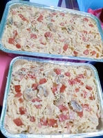
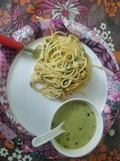
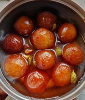
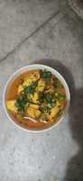
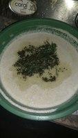
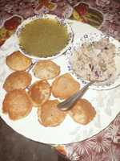

# Indian Food Image Dataset   

This dataset consists of images of Indian food.

**Introduction**    
Dataset consists of images of Indian food captured using mobile phones in a real-world scenario. Images were captured under wide variety of indoor lighting conditions. It consists of wide variety of dish images taken accross India.  This dataset can be used for recoginition, fine-grained detection of wide variety of cooked food. This can also be used to health related analytics like calorie counting, understanding dish ingredients etc. Each image can have multiple labels based on the use case.    

**Dataset Features**  
* Captured by 5000+ unique users
* Covers wide variety of Indian dishes
* Captured using mobile phones    
* Highly diverse 
* Various lighting conditions  
* Indoor scenes     

**Dataset Format**  
* Classification and detection annotations available  
* Multiple category annotations possible 
* COCO, PASCAL VOC and YOLO formats  
* Approx. 3500 unique images  

**Sample Images**  
          

# Datacluster Labs Datasets

Datacluster Labs focuses on Crowd Data Collection through our managed crowd-sourcing platform - [Dailydata](https://play.google.com/store/apps/details?id=com.daily.data). 

We provide integrated services for your AI needs:  
* Data Collection  
* Data Curation  
* Data Annotation 

We deal with all types of multimedia data collection and annotation like images, videos, audio, text and surveys.

**To download full datasets or to submit a request for your dataset needs, please contact **contact@datacluster.in****  

To download the full datasets, please contact [contact@datacluster.in](contact@datacluster.in).  
Visit [www.datacluster.in](www.datacluster.in) to know more.
    

**Note:**  
**All the images are manually verified and are contributed by the large contributor base on our platform.** 